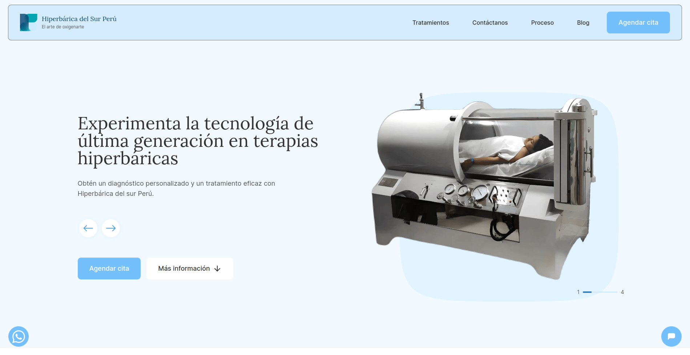
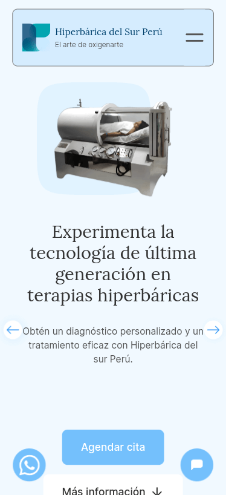

# Hiperbarica del Sur Peru

Hiperbarica del Sur Peru is a website for a clinic that offers hyperbaric oxygen therapy (HBOT) for various diseases and conditions. The website aims to inform and educate the potential customers about the benefits and effectiveness of HBOT, as well as to provide them with an easy and convenient way to book an appointment online.

## Features

The website has the following features:

- A blog section that contains articles and news about HBOT and related topics, gathering the latest research on HBOT and its effectiveness on multiple diseases.
- A server-side content search algorithm that allows the users to find blogs not only by their title but by their content too.
- An interactive map that uses the user's current location to show directions on how to get to the clinic, using Google Maps API.
- A chatbot that implements AI that has been trained in the whole knowledge of this website to assist the users in everything they want to know about HBOT, such as the treatment process, locations, diseases it can treat, effectiveness, etc.
- An appointment system that integrates with Cal.com for making appointments directly from the website, using a simple and user-friendly interface.

## Technologies

The website is built with the following technologies and tools:

- [Next.js 13](https://nextjs.org/) - A React framework for building fast and scalable web apps and static sites.
- [Tailwind](https://tailwindcss.com/) - A utility-first CSS framework for rapidly building custom designs.
- [Vercel](https://vercel.com/) - A platform for deploying and hosting Next.js apps with zero configuration.
- [Contentlayer](https://contentlayer.dev/) - A library that turns any content source into a GraphQL or REST API at build time.
- [Cal.com](https://cal.com/) - A platform for scheduling meetings and appointments online.
- [Botpress.com](https://botpress.com/) - A platform that provides an intuitive interface and powerful tools for building conversational agents with NLP.
- [Google Maps API](https://developers.google.com/maps) - A web service that provides maps and directions data.

## Installation

To run the website locally, follow these steps:

1. Clone this repository: `git clone https://github.com/yourusername/hiperbaricadelsurperu.git`
2. Change to the cloned directory: `cd hiperbarica-clinic`
3. Install the dependencies: `npm install`
4. Run the development server: `npm run dev`
5. Open http://localhost:3000 in your browser.

## Demo

You can see a live demo of the website here: https://hiperbaricadelsurperu.com/

Here are some screenshots of how the website looks on different devices:

## Challenges and Learnings

Some of the challenges and learnings that I faced while working on this project are:

- Using server components in Next.js 13 to render parts of the website on the server and reduce the JavaScript sent to the client, enhancing performance and user experience.
- Training a chatbot in company copy and all blog posts using botpress.com, a platform that offers an intuitive interface and powerful tools for building conversational agents with NLP.
- Developing a fast, reliable and server-side content search algorithm for the blog and treatments pages using plain JavaScript that runs on the server at runtime.
- Optimizing performance using Lighthouse, Web Vitals, which are tools that measure and improve the quality of the website in terms of loading speed, interactivity, accessibility, SEO, etc.
- Implementing a fast and performant interactive map using Google Cloud platform, which provides me with APIs and services for working with maps and location data, such as geocoding, directions, places, etc.
